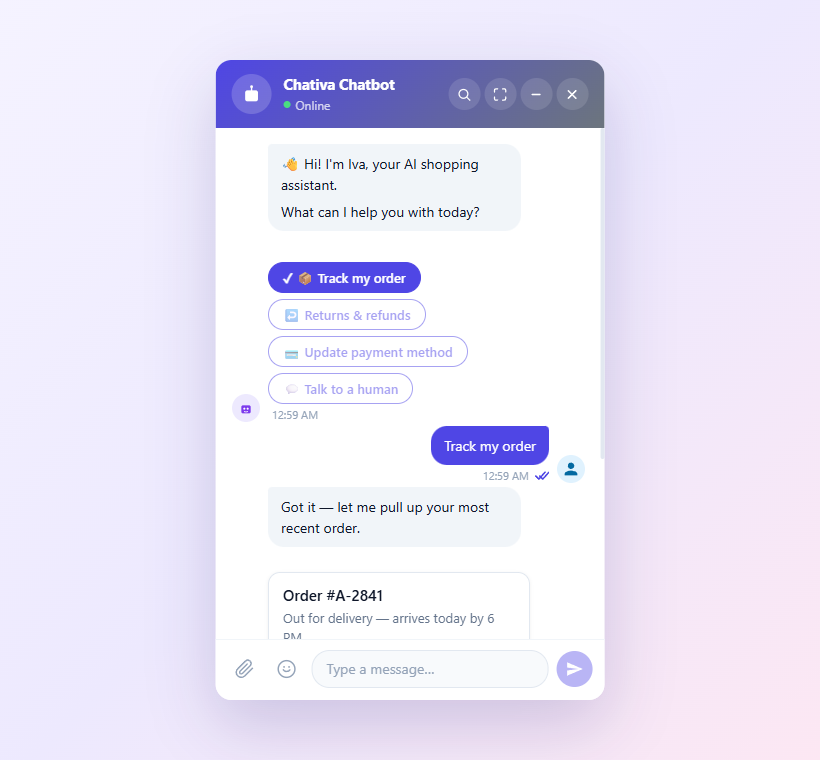

# Chativa

[](LICENSE)
[](https://www.typescriptlang.org/)
[](https://lit.dev/)
[](https://vitest.dev/)

**Chativa** is an open-source, framework-agnostic chat widget built on Web Components. Drop one `<script>` tag into any page — React, Vue, Angular, plain HTML — and you have a fully functional, themeable chat interface. Connect to any backend via pluggable connectors, render rich message types, stream Generative UI inline, and extend the pipeline with middleware.


> _Docs:_ **<https://chativa.aimtune.dev>** · _Live demo:_ **<https://chativa.aimtune.dev/sandbox/>**

## Quick start

```html
<script type="module" src="https://unpkg.com/@chativa/ui/dist/chativa.js"></script>

<chat-bot-button></chat-bot-button>
<chat-iva></chat-iva>
```

That's it — the default `dummy` connector echoes whatever you type. Wire to your backend:

```ts
import { ConnectorRegistry, chatStore } from "@chativa/core";
import { DirectLineConnector } from "@chativa/connector-directline";

ConnectorRegistry.register(new DirectLineConnector({ token: "YOUR_TOKEN" }));
chatStore.getState().setConnector("directline");
```

Or set everything declaratively before the script tag:

```html
<script>
  window.chativaSettings = {
    connector: "directline",
    theme: { colors: { primary: "#1B1464" }, windowMode: "popup" },
    locale: "tr",
  };
</script>
```

Full guide → [docs/getting-started.md](docs/getting-started.md).

## What's in the box

| Capability | Details |
|---|---|
| **Pluggable connectors** | [Dummy, WebSocket, SignalR, DirectLine, SSE, HTTP](docs/connectors/overview.md) — or write your own. |
| **Rich messages** | [text, image, card, buttons, quick-reply, carousel, file, video](docs/message-types/built-in.md) — register custom types. |
| **Generative UI** | [Stream LitElement components inline](docs/genui/overview.md) — forms, charts, tables, your own widgets. |
| **Extensions** | [Middleware lifecycle](docs/extensions.md) for analytics, transformers, and slash commands. |
| **Themable** | [CSS variables + JSON config + fluent builder](docs/theming.md). Four window modes. |
| **i18n** | English & Turkish out of the box; [extend at runtime](docs/i18n.md). |
| **End-of-conversation survey** | [Star rating + comment](docs/survey.md), connector-routed. |
| **Multi-conversation** | [Agent-panel mode](docs/multi-conversation.md) for helpdesk scenarios. |

## Documentation

| | |
|---|---|
| [Getting started](docs/getting-started.md) | 5-minute embed walkthrough |
| [Architecture](docs/architecture.md) | Hexagonal layers, dependency rules, request flow |
| [Configuration](docs/configuration.md) | `ChativaSettings` and `ThemeConfig` reference |
| [Theming](docs/theming.md) | Colors, layout, window modes, custom launchers |
| [Connectors](docs/connectors/overview.md) | Capability matrix + per-connector pages |
| [Message types](docs/message-types/overview.md) | Built-ins + custom renderers |
| [Generative UI](docs/genui/overview.md) | Streaming protocol, built-in components, custom widgets |
| [Extensions](docs/extensions.md) | Middleware lifecycle |
| [Slash commands](docs/slash-commands.md) | Built-ins + registering your own |
| [Survey](docs/survey.md) | End-of-conversation flow |
| [Multi-conversation](docs/multi-conversation.md) | Agent-panel mode |
| [i18n](docs/i18n.md) | Localisation |
| [Sandbox](docs/sandbox.md) | The hosted playground |
| [Chrome extension](docs/chrome-extension.md) | Theme-preview extension for any website |
| [JSON Schemas](schemas/README.md) | Editor-friendly contracts for every JSON-serialisable shape |

## Repository layout

```
packages/
  core/                  @chativa/core            Domain + Application layers
  ui/                    @chativa/ui              LitElement chat widget
  genui/                 @chativa/genui           Generative UI streaming
  connector-dummy/       @chativa/connector-dummy
  connector-websocket/   @chativa/connector-websocket
  connector-signalr/     @chativa/connector-signalr
  connector-directline/  @chativa/connector-directline
  connector-sse/         @chativa/connector-sse
  connector-http/        @chativa/connector-http

apps/
  sandbox/               Live demo (https://chativa.aimtune.dev/sandbox/)
  chrome-extension/      Theme-preview Chrome extension

docs/                    Documentation hub (you are here)
schemas/                 JSON Schemas for every JSON-serialisable contract
```

## Development

```bash
pnpm install          # install everything
pnpm dev              # serve the sandbox at http://localhost:5173
pnpm build            # build all packages
pnpm test             # run all tests
pnpm typecheck        # strict type-check across the workspace
```

The schema-drift test (`packages/core/src/domain/value-objects/__tests__/schema-drift.test.ts`) guards the contract between [`schemas/theme.schema.json`](schemas/theme.schema.json) and the `ThemeConfig` TypeScript type. Add a field to one without the other and CI fails. See [AGENTS.md → Schema sync](AGENTS.md#schema-sync-rule).

## Contributing

Conventions, architecture rules, and PR checklists are in [AGENTS.md](AGENTS.md). Open an issue first for big changes.

## License

[MIT](LICENSE) — © [Hamza Agar](https://github.com/AimTune)
