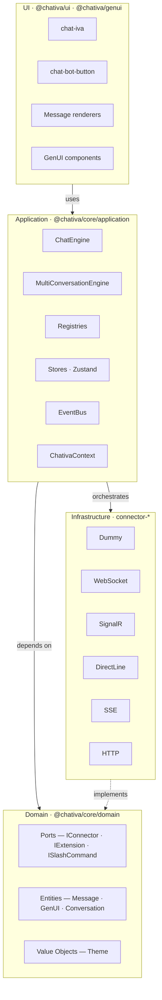
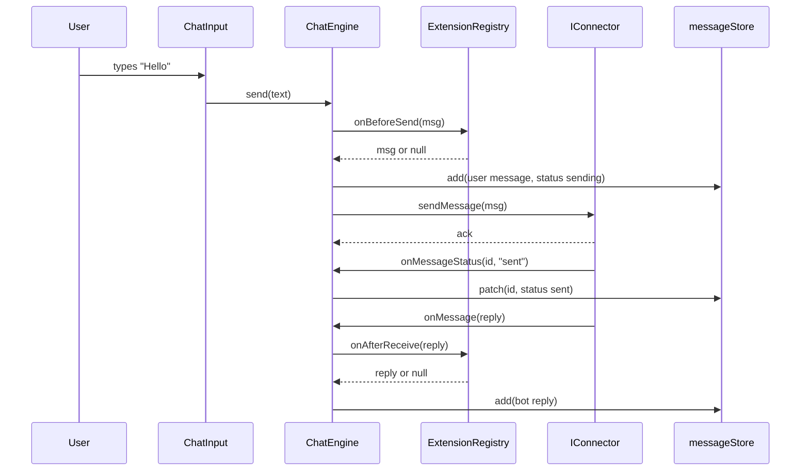

# Architecture

Chativa is a **Hexagonal (Ports & Adapters)** TypeScript monorepo. The dependency rule is enforced by file structure, by `tsconfig` paths, and by code review:

```
UI → Application → Domain ← Infrastructure
```

Inner layers never import from outer layers.


> _Screenshot placeholder — see [docs/assets/screenshots/README.md](./assets/screenshots/README.md)._

## Layered view

| Layer | Package | Contents |
|---|---|---|
| **UI** | `@chativa/ui`, `@chativa/genui` | LitElement Web Components — `chat-iva`, `chat-bot-button`, message renderers, GenUI components. |
| **Application** | `@chativa/core` (`application/`) | `ChatEngine`, `MultiConversationEngine`, registries, Zustand stores, `EventBus`, `ChativaContext`, `applyGlobalSettings()`. |
| **Domain** | `@chativa/core` (`domain/`) | Pure types: ports (`IConnector`, `IExtension`, `ISlashCommand`, `IMessageRenderer`), entities (`Message`, `GenUI`, `Conversation`), value objects (`Theme`, `ThemeBuilder`). |
| **Infrastructure** | `connector-*` packages | Adapters: `Dummy`, `WebSocket`, `SignalR`, `DirectLine`, `SSE`, `HTTP`. |



## What lives where

### `domain/` — pure types

Zero runtime imports. No DOM, no `lit`, no `zustand`. If you need to add a class with side effects, it doesn't belong here.

- `ports/IConnector.ts` — the connector contract (15+ optional capability hooks).
- `ports/IExtension.ts` — middleware lifecycle (`onBeforeSend`, `onAfterReceive`, `onWidgetOpen/Close`).
- `ports/ISlashCommand.ts` — slash command contract.
- `ports/IMessageRenderer.ts` — message component contract.
- `entities/Message.ts` — `IncomingMessage`, `OutgoingMessage`, `MessageAction`, `MessageStatus`, `HistoryResult`.
- `entities/GenUI.ts` — `AIChunk`, `GenUIStreamState`, `GenUIChunkHandler`.
- `entities/Conversation.ts` — multi-conversation entity.
- `value-objects/Theme.ts` — `ThemeConfig`, `mergeTheme()`, `themeToCSS()`, `DEFAULT_THEME`.
- `value-objects/ThemeBuilder.ts` — fluent theme builder.

### `application/` — orchestration

- `ChatEngine` — wires a connector to the stores and extension pipeline. Owns reconnect logic.
- `MultiConversationEngine` — runs many `ChatEngine`s; lazy-mounts per conversation.
- Registries — `ConnectorRegistry`, `MessageTypeRegistry`, `ExtensionRegistry`, `SlashCommandRegistry`.
- Stores (Zustand vanilla) — `chatStore`, `messageStore`, `conversationStore`.
- `EventBus` — typed pub/sub for analytics hooks.
- `ChativaContext` + `createChativaContext()` — facade injected into connectors and extensions.
- `ChativaSettings` + `applyGlobalSettings()` — reads `window.chativaSettings` and applies it before mount.

### `connector-*` packages — adapters

Each implements `IConnector`. Optional capabilities are feature-detected at runtime via `typeof connector.sendFile === "function"`. See [connectors/overview](./connectors/overview.md).

### `ui/` and `genui/` — Web Components

LitElement components. State comes exclusively from `chatStore` / `messageStore` subscriptions — components never instantiate connectors or registries directly.

## Request flow



## Why hexagonal?

- Swap any connector without touching UI or core code.
- Test `ChatEngine` against a mock `IConnector` with no DOM and no network.
- Keep `domain/` framework-free — same types could power a React Native renderer in v2.
- The contract drift between `domain/` types and the JSON Schemas in `schemas/` is automatically guarded — see [schema sync](../schemas/README.md).
