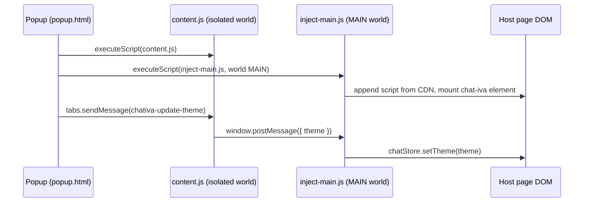

# Chrome extension — Theme preview

A Manifest V3 Chrome extension that lets you inject Chativa onto **any website**, tweak the theme live, and copy the resulting JSON / `ThemeBuilder` code straight into your own project. Useful for design reviews and "what would this look like on the customer's actual page" demos.


> _Screenshot pending capture._

Source: [`apps/chrome-extension/`](https://github.com/AimTune/chativa/tree/main/apps/chrome-extension).

## Install

### From source

```bash
pnpm install
pnpm --filter @chativa/chrome-extension build
```

The build produces `apps/chrome-extension/dist/`. In Chrome:

1. Open `chrome://extensions`.
2. Enable **Developer mode** (top right).
3. Click **Load unpacked** and select `apps/chrome-extension/dist`.

The extension appears in your toolbar.


> _Screenshot pending capture._

### From the Chrome Web Store

> Once published, this section will link to the listing.

## Usage

1. Visit any page where you'd like to preview Chativa.
2. Click the extension's toolbar icon — the popup opens.
3. Tweak colors, position, layout, window mode, and feature flags.
4. Click **Inject Widget on This Page**. The widget appears live on the host page.
5. Continue editing — every change pushes a `chativa-update-theme` message to the injected widget; updates are instant.
6. Click **Update Theme** (after any edit) to re-push, or **Remove Widget** to clean up.


> _Screenshot pending capture._

## Export

The popup's **Export** section gives you three drop-in formats:

| Format | Where to paste |
|---|---|
| **CDN snippet** | A standalone HTML/JS block — `<script>` plus `<chat-bot-button>` / `<chat-iva>` tags. |
| **JSON config** | The `ThemeConfig` object — drop into `window.chativaSettings.theme`. |
| **`ThemeBuilder`** | TypeScript fluent-builder code — paste into your app where you set the theme. |

Each format is one click to copy.

## How injection works



- `content.js` lives in the extension's isolated world and bridges between the popup and the page.
- `inject-main.js` runs in the page's MAIN world, so it can touch `chatStore` and `customElements` directly.
- The popup persists the theme to `chrome.storage.local` (`chativa_theme` key) so reopening keeps your edits.

## Manifest

[`apps/chrome-extension/manifest.json`](https://github.com/AimTune/chativa/blob/main/apps/chrome-extension/manifest.json):

```jsonc
{
  "manifest_version": 3,
  "name": "Chativa Theme Preview",
  "version": "1.0.0",
  "description": "Inject and preview the Chativa chat widget on any website — customize colors, position, and style.",
  "permissions": ["activeTab", "scripting", "storage"],
  "host_permissions": ["<all_urls>"],
  "action": {
    "default_popup": "popup.html",
    "default_title": "Chativa Theme Preview",
    "default_icon": {
      "16":  "icons/icon-16.png",
      "32":  "icons/icon-32.png",
      "48":  "icons/icon-48.png",
      "128": "icons/icon-128.png"
    }
  },
  "icons": {
    "16":  "icons/icon-16.png",
    "32":  "icons/icon-32.png",
    "48":  "icons/icon-48.png",
    "128": "icons/icon-128.png"
  }
}
```

## Limitations

- Some pages (`chrome://`, `chrome.google.com/webstore`, the Web Store itself) block content-script injection — the popup will display "Cannot inject on this page."
- The injected widget loads `@chativa/ui` from `unpkg.com`. If the host page has a strict CSP that blocks `unpkg.com`, injection fails. There's no workaround besides relaxing the CSP on a page you control.
