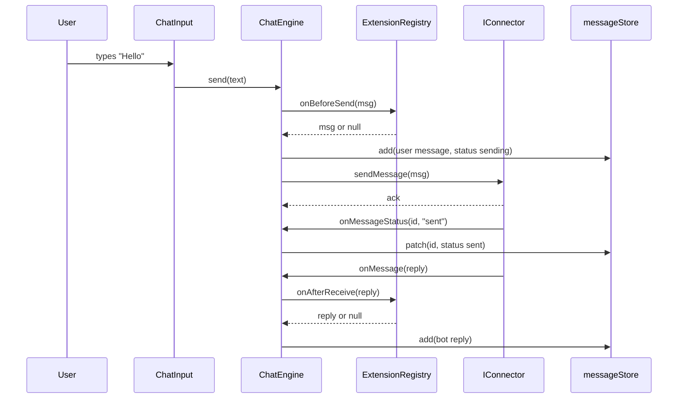

# Concepts

If you read just the [Getting started](./getting-started.md) page you can ship a chat widget. This page explains *why* the codebase is shaped the way it is — so when you go beyond the happy path you know which knob to turn.

We'll work bottom-up: the smallest abstraction first, then how they compose.

## 1. Why Web Components?

Chativa's UI is a **Web Component** — specifically, a [LitElement](https://lit.dev/) custom element called `<chat-iva>`. There are three reasons that matters:

1. **Framework-free.** Web Components are a browser standard. They run identically in React, Vue, Angular, Svelte, or no framework at all. There's no React-specific build of Chativa, because there doesn't need to be.
2. **Style isolation.** Every Chativa component renders inside a **Shadow DOM**. The host page's CSS can't leak into the widget, and Chativa's CSS can't leak out. You theme via documented CSS variables — `--chativa-color-primary`, `--chativa-radius`, etc. — and nothing else.
3. **Lazy & composable.** A custom element is just a tag. You can render `<chat-iva>` inside any layout, slot custom launchers, or skip the launcher and call `chatStore.open()` from your own button.

The cost: you need to opt your framework's template compiler into recognizing custom elements. The [Getting started](./getting-started.md#step-3--framework-by-framework) page has the snippets.

## 2. Ports & Adapters (Hexagonal Architecture)

Now the architecture. The codebase is organized as **Ports & Adapters**, a.k.a. Hexagonal Architecture. Don't worry about the name — the rule is short:

> **The domain doesn't know about the world. The world depends on the domain.**

Concretely, Chativa has four layers, and dependencies always point **inward**:

```
   ┌─────────────────────────────────────┐
   │ UI · @chativa/ui · @chativa/genui  │   ← LitElement components
   └────────────────┬───────────────────┘
                    ↓
   ┌─────────────────────────────────────┐
   │ Application · @chativa/core/        │   ← ChatEngine, registries, stores
   │              application/           │
   └────────────────┬───────────────────┘
                    ↓
   ┌─────────────────────────────────────┐
   │ Domain · @chativa/core/domain/      │   ← Pure types, no imports
   └────────────────▲───────────────────┘
                    │
   ┌─────────────────────────────────────┐
   │ Infrastructure · connector-* pkgs  │   ← Implements domain ports
   └─────────────────────────────────────┘
```

Read it as:

- **Domain** is just TypeScript types. Pure interfaces. No `lit`, no DOM, no `fetch`, no `zustand`. If you compiled Chativa to React Native tomorrow, `domain/` would survive untouched.
- **Application** uses the domain types to orchestrate behavior. It owns the registries and stores. It depends on domain only.
- **Infrastructure** (the connector packages) implements domain ports — `IConnector`, `IExtension`. Each connector is a self-contained npm package that depends only on `@chativa/core` types.
- **UI** depends on application + domain. It never imports a connector package directly. It talks to whatever connector is currently active by going through the `ConnectorRegistry`.

### Why bother?

Because it makes the boring questions easy:

- **"Can I swap WebSocket for SignalR?"** Yes — different package, same `IConnector` port, no UI changes.
- **"Can I unit-test `ChatEngine`?"** Yes — pass it a mock object that implements `IConnector`. No DOM, no network.
- **"Can I add a third backend protocol?"** Yes — write a 30-line class that implements `IConnector`. Done.

The architecture rules are enforced by file structure (`domain/` has no imports), `tsconfig` paths, and code review. The [`AGENTS.md`](https://github.com/AimTune/chativa/blob/main/AGENTS.md) file lists them; the [chativa-architect](https://github.com/AimTune/chativa/blob/main/.claude/agents/chativa-architect.md) Claude subagent enforces them on PRs.

## 3. Ports — the contracts

A "port" is just an interface. Chativa has four:

### `IConnector` — talks to your backend

This is the central port. It lives in [`packages/core/src/domain/ports/IConnector.ts`](https://github.com/AimTune/chativa/blob/main/packages/core/src/domain/ports/IConnector.ts) and is the contract every transport must implement.

The **required** surface is tiny:

```ts
interface IConnector {
  readonly name: string;
  connect(): Promise<void>;
  disconnect(): Promise<void>;
  sendMessage(message: OutgoingMessage): Promise<void>;
  onMessage(callback: MessageHandler): void;
}
```

Everything else is **optional capability hooks** that the engine feature-detects with `typeof`:

| Capability | When the widget uses it |
|---|---|
| `sendFile?(file, metadata?)` | Attach button — only enabled if implemented. |
| `loadHistory?(cursor?)` | Pagination — initial load + scroll-to-top. |
| `onMessageStatus?(cb)` | Tick indicators (sending → sent → read). |
| `sendFeedback?(id, "like" \| "dislike")` | Like/dislike buttons on bot messages. |
| `onTyping?(cb)` | "Bot is typing…" indicator. |
| `sendSurvey?(payload)` | End-of-conversation survey delivery. |
| `onGenUIChunk?(cb)` | Generative UI streaming. |
| `receiveComponentEvent?(...)` | Bidirectional events from streamed components. |
| `listConversations?` / `createConversation?` / `switchConversation?` / `closeConversation?` / `onConversationUpdate?` | Multi-conversation (agent-panel) mode. |
| `setContext?(ctx)` | Receive the `ChativaContext` facade so handlers can manipulate the widget. |

If your backend doesn't support file uploads, just don't implement `sendFile`. The attach button stays hidden. No flags, no config — the capability matrix is the implementation.

See [Custom connector](./connectors/custom.md) for the full walkthrough.

### `IExtension` — middleware between the connector and the UI

Extensions are where you put cross-cutting concerns: analytics, redaction, custom slash commands, A/B test wiring. They're installed once and hook into the pipeline:

```ts
interface IExtension {
  readonly name: string;
  readonly version: string;
  install(context: ExtensionContext): void;
  uninstall?(): void;
}

interface ExtensionContext {
  onBeforeSend(handler: (msg: OutgoingMessage) => OutgoingMessage | null): void;
  onAfterReceive(handler: (msg: IncomingMessage) => IncomingMessage | null): void;
  onWidgetOpen(handler: () => void): void;
  onWidgetClose(handler: () => void): void;
  registerCommand(command: ISlashCommand): void;
}
```

Returning `null` from `onBeforeSend` cancels the send. Returning `null` from `onAfterReceive` drops the incoming message before it ever reaches the message store. Hooks fire in install order. See [Extensions](./extensions.md).

### `ISlashCommand` — `/` commands in the input

A slash command is `{ name, description, execute({ args }) }`. Built-ins include `/clear`, `/help`, `/theme`. You can register your own from inside an extension or directly via `SlashCommandRegistry`. See [Slash commands](./slash-commands.md).

### `IMessageRenderer` — how a message type maps to a component

Message types are registered string keys (`"text"`, `"card"`, `"buttons"`, etc.) that map to a custom-element constructor. When a connector emits `{ type: "card", data: {...} }`, the engine asks `MessageTypeRegistry.resolve("card")` for the right component class to render. See [Message types](./message-types/overview.md).

## 4. Registries — runtime tables of "what's available"

Each port has a singleton registry in `application/registries/`:

| Registry | What it holds | Public API |
|---|---|---|
| `ConnectorRegistry` | Available `IConnector` instances by `name` | `register()`, `get()`, `has()`, `list()`, `clear()` |
| `ExtensionRegistry` | Installed `IExtension`s + their hook lists | `install()`, `uninstall()`, `runBeforeSend()`, `runAfterReceive()` |
| `MessageTypeRegistry` | Type-key → component constructor | `register()`, `resolve()`, `has()` |
| `SlashCommandRegistry` | Command name → `ISlashCommand` | `register()`, `get()`, `list()` |

Registries are intentionally **boring** — they're glorified `Map`s. The interesting code lives in the engine that uses them. The point of the registry is that registration is **decoupled from instantiation**: a connector package doesn't know whether it's the active connector, it just registers itself; a custom message type self-registers on import; an extension is installed once and forgotten.

Tests always start with `Registry.clear()` in `beforeEach` to avoid cross-test pollution.

## 5. Stores — observable state

Chativa uses [Zustand vanilla](https://zustand-demo.pmnd.rs/) (no React) for state management. Three stores:

### `chatStore`

Widget-level state: is it open, the active connector name, theme, language, typing indicator, unread count, connection status, reconnect attempt.

```ts
import { chatStore } from "@chativa/core";

chatStore.getState().toggle();              // open/close the panel
chatStore.getState().setTheme({ ... });     // patch theme
chatStore.getState().setConnector("ws");    // switch connector
const unsub = chatStore.subscribe((s) => {  // observe
  console.log("opened?", s.isOpened);
});
```

### `messageStore`

The conversation log. Add messages, update by id (for status patches), clear, replace from history-load.

### `conversationStore`

Only used in **multi-conversation** (agent-panel) mode. Lists, sorts, and selects conversations. See [Multi-conversation](./multi-conversation.md).

## 6. The `ChatEngine` — where it all comes together

`ChatEngine` is the orchestrator. It wires a connector to the stores and the extension pipeline. The flow:



A few things to notice:

- The engine **never** instantiates a connector. It receives one in the constructor (or implicitly via `ConnectorRegistry`).
- Every message flows through the extension pipeline — twice: outgoing (`onBeforeSend`) and incoming (`onAfterReceive`).
- Status updates are routed by `messageId`, so the engine can patch a previously-added message in-place.

## 7. Generative UI

Generative UI is the streaming protocol that lets your backend emit a sequence of typed chunks (text fragments, custom UI declarations, events) which Chativa renders as a single, evolving message in the chat. Think "the bot replied with a `<genui-form>` that has live state". See [Generative UI → Overview](./genui/overview.md) for the protocol details — but the key insight is that GenUI components are just **another LitElement** registered in `GenUIRegistry`, identical in spirit to message types.

## 8. The `ChativaContext` facade

When a connector opts in by implementing `setContext?(ctx)`, the engine hands it a small facade exposing the things a backend handler typically wants:

```ts
interface ChativaContext {
  setTheme(partial): void;
  setLanguage(locale): void;
  open(): void;
  close(): void;
  on(event, handler): () => void;
  emit(event, data): void;
  // ... see packages/core/src/application/ChativaContext.ts
}
```

This is how the DirectLine connector, for example, can react to a server event by switching theme color or opening the widget.

## 9. JSON Schemas — the contract on the wire

Every JSON-serializable shape in Chativa has a published schema in [`schemas/`](https://github.com/AimTune/chativa/tree/main/schemas):

- `chativa-settings.schema.json`
- `theme.schema.json`
- `messages/incoming-message.schema.json`, `outgoing-message.schema.json`, …
- `genui/ai-chunk.schema.json`
- `connectors/<name>.schema.json` for each connector's options

The schemas and the TypeScript types are kept in lock-step by a drift test (`schema-drift.test.ts`). Any field you add to one without the other fails CI. Drop the `$schema` URL into your config file and your editor gives you autocompletion + validation for free.

## Summary

You now have the full mental model:

| Term | One-line summary |
|---|---|
| **Web Component** | The widget is a custom element with Shadow DOM. Works in any framework. |
| **Domain** | Pure TypeScript types in `packages/core/src/domain/`. Zero imports. |
| **Port** | An interface — `IConnector`, `IExtension`, `ISlashCommand`, `IMessageRenderer`. |
| **Adapter** | An implementation of a port — connector packages, your extensions. |
| **Registry** | A `Map` of name → instance for each port. |
| **Store** | Zustand-vanilla observable state — `chatStore`, `messageStore`, `conversationStore`. |
| **`ChatEngine`** | Orchestrator — wires a connector to stores via the extension pipeline. |
| **`ChativaContext`** | Facade injected into connectors so they can manipulate the widget. |
| **GenUI** | Streamed components — your agent emits chunks, Chativa renders a live message. |

If anything still feels fuzzy, the source is short — under 5,000 lines of TypeScript, all strict-mode, all open. Start with [`packages/core/src/domain/ports/IConnector.ts`](https://github.com/AimTune/chativa/blob/main/packages/core/src/domain/ports/IConnector.ts) and follow the imports.
